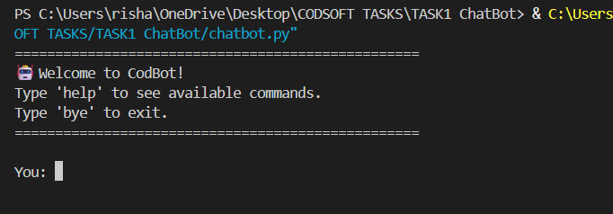
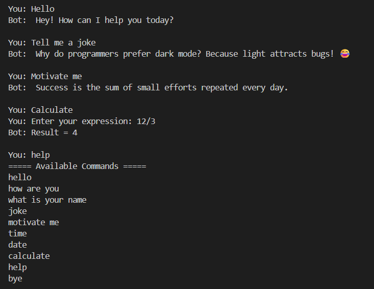
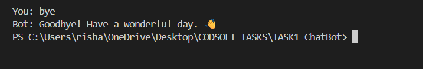

# 🤖 CodBot - Rule Based Chatbot

A simple rule-based chatbot developed using Python. The chatbot responds to predefined user inputs such as greetings, jokes, motivational quotes, and general conversation. It demonstrates the fundamentals of chatbot development using conditional statements, functions, and random responses.

---

## 📌 Features

- 🤖 Interactive command-line chatbot
- 💬 Responds to greetings
- 😂 Tells random programming jokes
- 💪 Shares motivational quotes
- 🎲 Randomized responses
- 🧹 Handles user input using `.strip()` and `.lower()`
- 🚪 Gracefully exits when the user types **bye**

---

## 🛠️ Technologies Used

- Python

---

## ⚙️ How It Works

1. The chatbot waits for user input.
2. The input is cleaned using `.strip()` and `.lower()`.
3. The chatbot compares the input with predefined responses.
4. For jokes and motivational quotes, a random response is selected.
5. The conversation continues until the user types **bye**.

---

## ▶️ Requirements

This project uses only Python's built-in libraries.

---

## ▶️ Run the Project

```bash
python chatbot.py
```

---

## 📸 Screenshots

### Welcome Screen



### Chat Conversation



### Exit Message



---

## 📁 Project Structure

```text
CODSOFT_TASKS/
│
└── Task1_Chatbot/
    │
    ├── chatbot.py
    ├── data.py
    ├── response.py
    ├── README.md
    ├── requirements.txt
    ├── .gitignore
    └── screenshots/
        ├── home.png
        ├── conversation.png
        └── exit.png
```

---

## 🚀 Future Improvements

- Add GUI using Tkinter
- Integrate NLP libraries
- Support voice input and output
- Add more conversation topics
- Connect with APIs for real-time information

---

## 👩‍💻 Developed By

**Riya**

Developed as part of the **CodSoft Python Programming Internship**.
