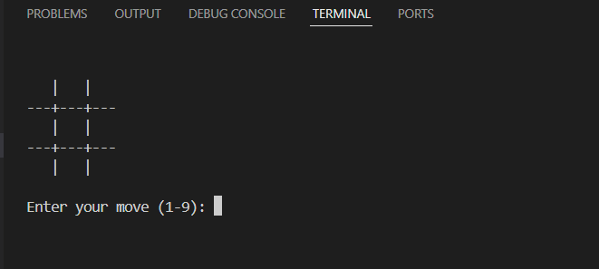
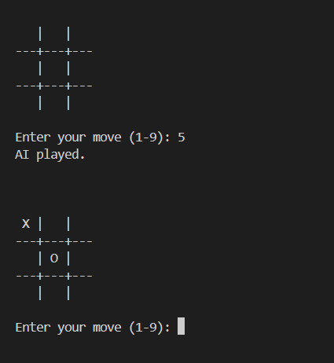
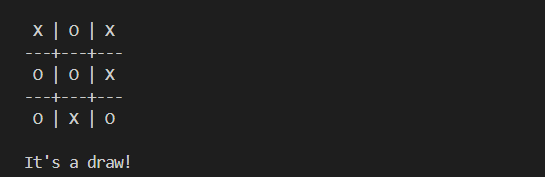

# 🎮 AI Tic-Tac-Toe

A Python-based Tic-Tac-Toe game where a human competes against an unbeatable AI. The AI uses the **Minimax Algorithm** to always choose the optimal move, making it impossible to defeat.

---

## 📌 Features

- 🎮 Human vs AI gameplay
- 🤖 AI powered by the Minimax Algorithm
- 🧠 Optimal move selection
- ❌ Impossible to defeat the AI
- ♻️ Uses recursion and backtracking
- 📟 Simple command-line interface
- 🏆 Detects wins, losses, and draws automatically

---

## 🛠️ Technologies Used

- Python

---

## ⚙️ How It Works

1. The game starts with an empty 3×3 board.
2. The human enters a position from **1 to 9**.
3. The AI evaluates every possible future move using the **Minimax Algorithm**.
4. The AI always selects the best possible move.
5. The game continues until either player wins or the game ends in a draw.

---

## 🧠 Minimax Algorithm

The AI evaluates every possible game state.

- **AI Win (X)** → Score = **1**
- **Human Win (O)** → Score = **-1**
- **Draw** → Score = **0**

The AI always chooses the move with the highest score, while the human's moves are evaluated as the lowest possible score.

---

## ▶️ Requirements

This project uses only Python's built-in libraries.

---

## ▶️ Run the Project

```bash
python tic_tac_toe.py
```

---

## 📸 Screenshots

### Home Screen



### Gameplay



### Final Result



---

## 📁 Project Structure

```text
CODSOFT_TASKS/
│
└── Task2_AI_TicTacToe/
    │
    ├── tic_tac_toe.py
    ├── README.md
    ├── requirements.txt
    ├── .gitignore
    └── screenshots/
        ├── home.png
        ├── gameplay.png
        └── result.png
```

---

## 🚀 Future Improvements

- Add a graphical user interface (GUI)
- Add difficulty levels (Easy, Medium, Hard)
- Allow Human vs Human mode
- Add score tracking
- Improve board design

---

## 👩‍💻 Developed By

**Riya**

Developed as part of the **CodSoft Python Programming Internship**.
