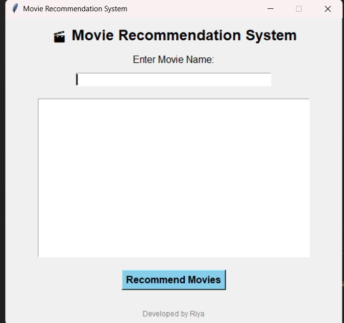
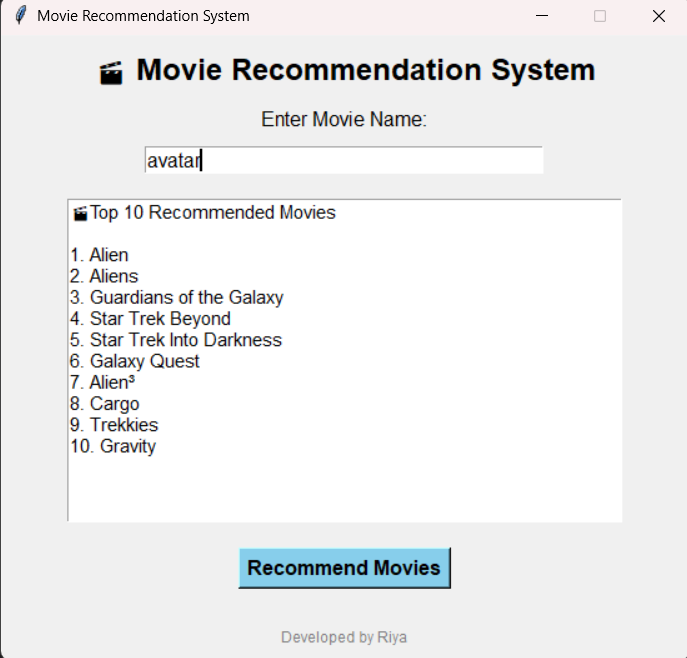
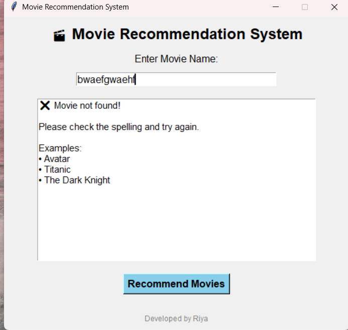

# 🎬 Movie Recommendation System

A Python-based Movie Recommendation System with a user-friendly graphical interface built using **Tkinter**. The system recommends the top 10 movies similar to the movie entered by the user using **TF-IDF Vectorization** and **Cosine Similarity**.

---

## 📌 Features

- 🎬 Simple and attractive GUI using Tkinter
- 🔍 Search movies by title
- 🤖 Recommends the Top 10 similar movies
- ⚡ Fast recommendation using TF-IDF and Cosine Similarity
- ❌ Handles invalid movie names gracefully
- ⌨️ Supports Enter key for quick recommendations
- 🖱️ Interactive and beginner-friendly interface

---

## 🛠️ Technologies Used

- Python
- Tkinter
- Pandas
- Scikit-learn
- Difflib

---

## 📂 Dataset

The project uses a movie dataset containing information such as:

- Movie Title
- Genres
- Keywords
- Tagline
- Cast
- Director

The recommendation system combines these features to find movies similar to the user's input.

---

## ⚙️ How It Works

1. The user enters a movie name.
2. The system finds the closest matching movie.
3. TF-IDF Vectorization converts movie information into numerical vectors.
4. Cosine Similarity calculates similarity between movies.
5. The top 10 most similar movies are displayed.

---

## ▶️ Installation

### Install required libraries

```bash
pip install -r requirements.txt
```

### Run the project

```bash
python gui.py
```

---

## 📸 Screenshots

### Home Screen



### Movie Recommendations



### Movie Not Found



---

## 📁 Project Structure

```text
CODSOFT_TASKS/
│
└── Task 4 - Movie Recommendation System/
    │
    ├── gui.py
    ├── recommandation.py
    ├── movie_dataset.csv
    ├── README.md
    ├── requirements.txt
    ├── .gitignore
    └── screenshots/
        ├── home.png
        ├── recommend.png
        └── movie_not_found.png
```
---

## 🚀 Future Improvements

- Add movie posters using TMDB API
- Add genre-based recommendations
- Improve GUI design
- Add dark mode
- Create an executable (.exe) version

---

## 👩‍💻 Developed By

**Riya**

Developed as part of the **CodSoft Python Programming Internship**.
